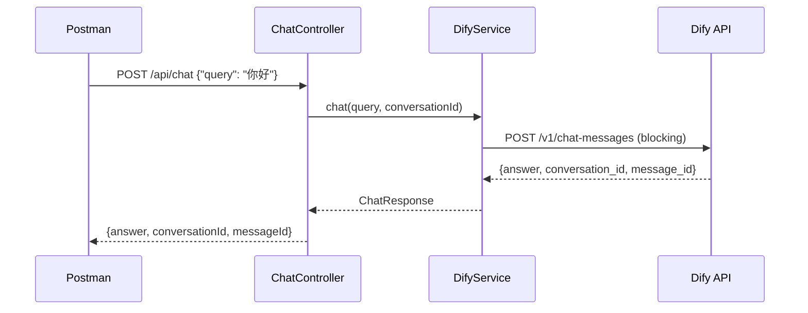

## 项目结构

```
src/main/java/cn/xiucai/springairag/
├── config/
│   ├── DifyProperties.java     # Dify API 配置属性
│   └── DifyConfig.java         # RestClient Bean 配置
├── controller/
│   └── ChatController.java     # REST 接口（/api/chat, /api/health）
├── dto/
│   ├── ChatRequest.java        # 前端请求 DTO
│   ├── ChatResponse.java       # 前端响应 DTO
│   ├── DifyChatRequest.java    # Dify API 请求 DTO
│   └── DifyChatResponse.java   # Dify API 响应 DTO
├── service/
│   └── DifyService.java        # Dify 对话服务核心逻辑
└── SpringAiRagApplication.java
```

## 核心流程



## 测试结果

### 单元测试 (8/8 通过 ✅)

| 测试类                           | 测试数 | 结果                        |
| ----------------------------- | --- | ------------------------- |
| `DifyServiceTest`             | 3   | ✅ 新会话、多轮对话、服务端错误          |
| `ChatControllerTest`          | 4   | ✅ 正常对话、空查询校验、null 校验、健康检查 |
| `SpringAiRagApplicationTests` | 1   | ✅ 上下文加载                   |

### 终端集成测试 ✅

**健康检查**：`GET http://localhost:9000/api/health` → `{"status": "UP", "service": "Spring-AI-Rag"}`

**对话接口**：`POST http://localhost:9000/api/chat` → Dify 成功返回 AI 回答 + conversationId + messageId

## 使用方法

### 启动应用

```powershell
$env:JAVA_HOME = "C:\Users\admin\.jdks\jdk-21.0.10+7"
$env:Path = "$env:JAVA_HOME\bin;$env:Path"
.\mvnw.cmd spring-boot:run
```

### Postman 调用

**POST** `http://localhost:9000/api/chat`

```json
{
    "query": "你的问题",
    "conversationId": "可选，用于多轮对话"
}
```
